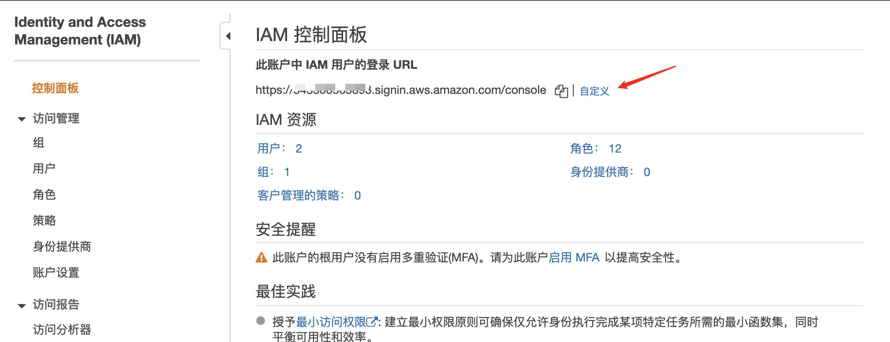
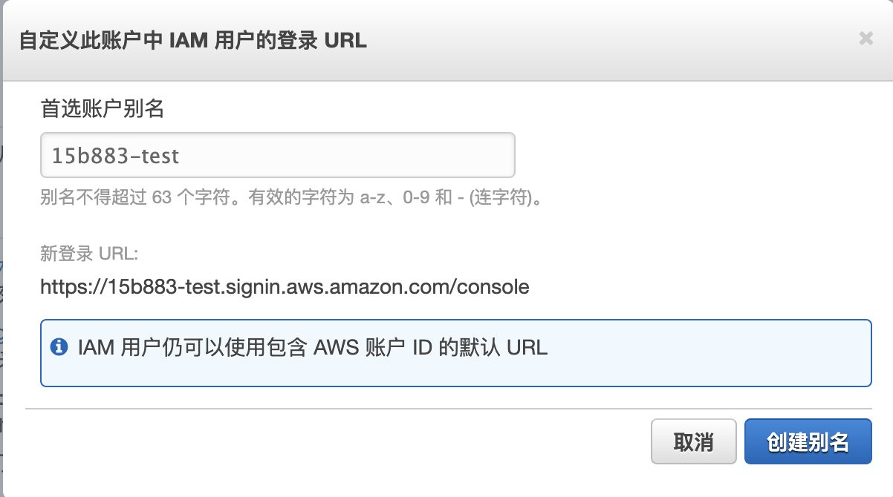
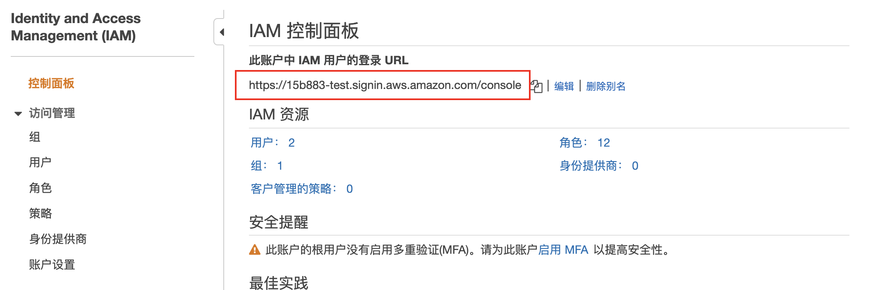

有时候对于在AWS登录页面的 URL 用公司名称（或其他友好标识）取代AWS 账户 ID，可以创建一个账户别名。

登录页面 URL 地址默认格式如下：
```markdown
https://Your_Account_ID.signin.aws.amazon.com/console/
```

如果为 AWS 账户 ID 创建一个 AWS 账户别名，登录页面 URL 地址格式如以下：
```markdown
https://Your_Account_Alias.signin.aws.amazon.com/console/
```

>创建 AWS 账户别名后，包含 AWS 账户 ID 的原始 URL 地址依然有效，可以使用

## 通过控制台修改

打开 IAM 控制台

如下图，选择自定义



填写别名信息



如图，为自定义后的别名



## 通过AWS CLI 修改

查看用户别名
```
aws iam list-account-aliases
{
    "AccountAliases": [
        "15b883-test"
    ]
}
```

设置账号ID别名

```
aws iam create-account-alias --account-alias 15b883-test 
```

删除账号ID别名
```
aws iam delete-account-alias --account-alias 15b883-test 
```