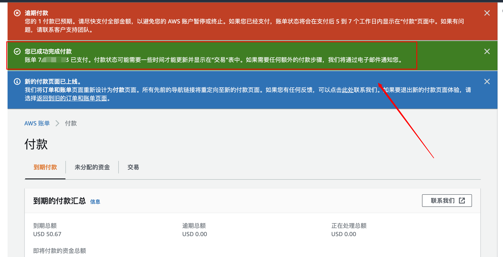

**扣款失败**

如下图，由于某些原因造成信用卡扣款失败。在账单控制台会显示如下

扣款失败了，有两种方式可以进行补缴费用

> 1、AWS账单控制台进行逾期付款
> 2、提工单申请二次扣款

**逾期付款**

如下图，选中需要进行付款的账单进行付款，点击完成付款

**确认付款信息**

**付款中**

**完成付款**

**查看状态**

**提工单**

1、在控制台，选择需要扣款的账单，记录账单ID。
2、在support中选择 Account and billing support - 
3、提交即可

**信用卡遭拒**

请检查下面信息

1、检查“账单和成本管理”控制台上的付款方式，确认您的信用卡号、到期日期、账单邮寄地址和电话号码是否正确。

注意：请确保您输入的账单邮寄地址和电话号码与您在信用卡发卡机构留存的信息一致。

2、确认向您提供服务的 AWS 卖家接受您的信用卡。AWS 卖家的名称记录在您的发票上。

AWS Inc. 接受 Visa、MasterCard、American Express、Discover、日本信用会社或中国银联发行的信用卡和借记卡。
AWS Europe 接受 Visa、MasterCard 或 American Express 发行的信用卡和借记卡。
AWS 支持 AISPL 账户使用 Visa、Mastercard 和 AMEX 信用卡。

3、检查您的信用卡发卡机构是否需要使用卡验证值 (CVV)。AWS 不支持 CVV 授权。

4、如果您是 AISPL 客户，请检查您的信用卡发卡机构是否需要使用 3-D 安全身份验证。AWS 不支持此身份验证解决方案。

5、如果您使用的是信用卡，请确保您的信用卡有足够的可用额度来支付您的 AWS 发票。如果额度不足，请让您的银行调整您的每日提款或支出限额。

6、与您的银行确认您授权支付 AWS 服务费用。AWS Inc. 和 AWS 欧洲账户的费用描述符以“aws.amazon.com”结尾。