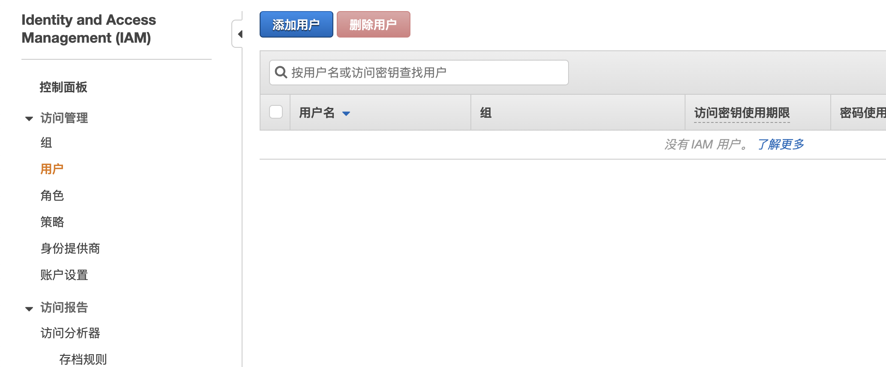
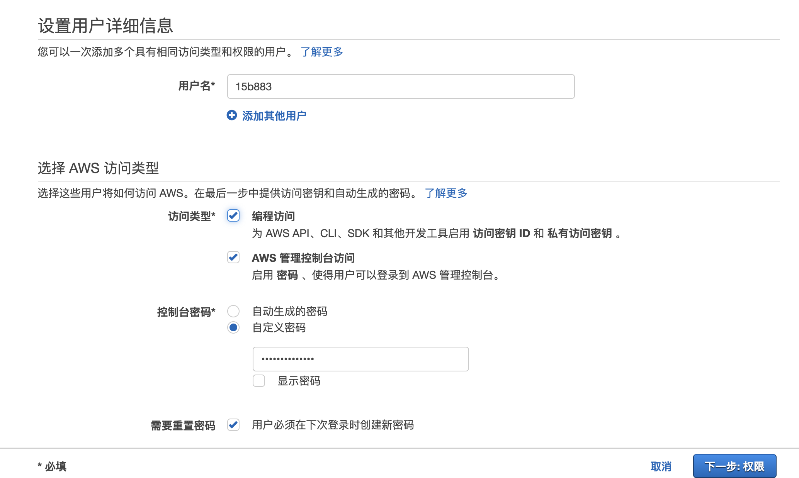
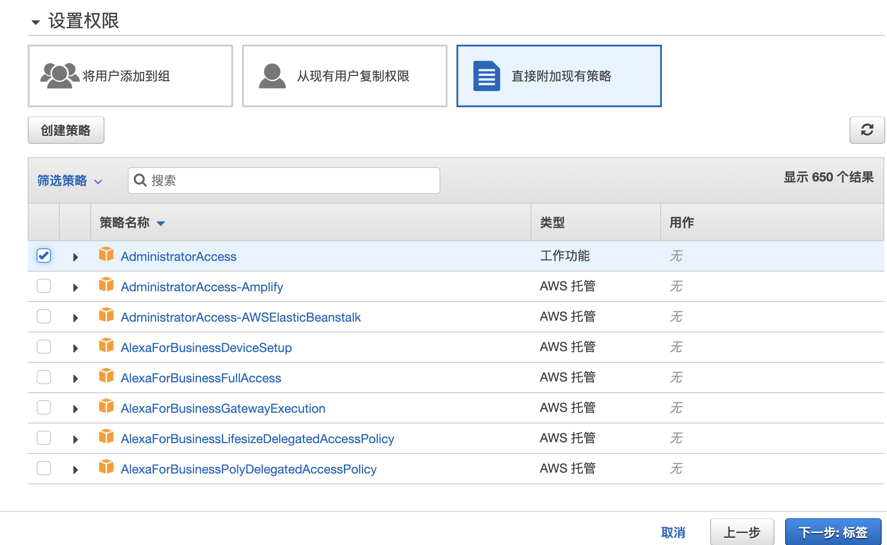
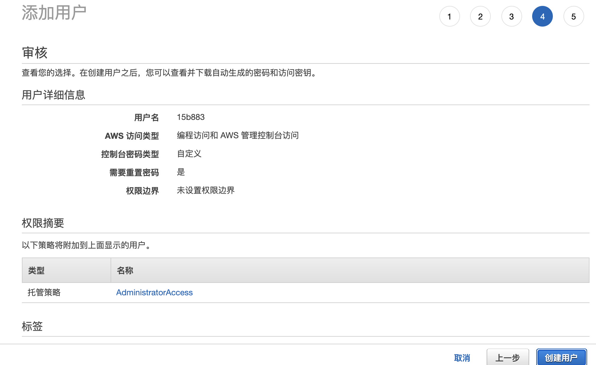
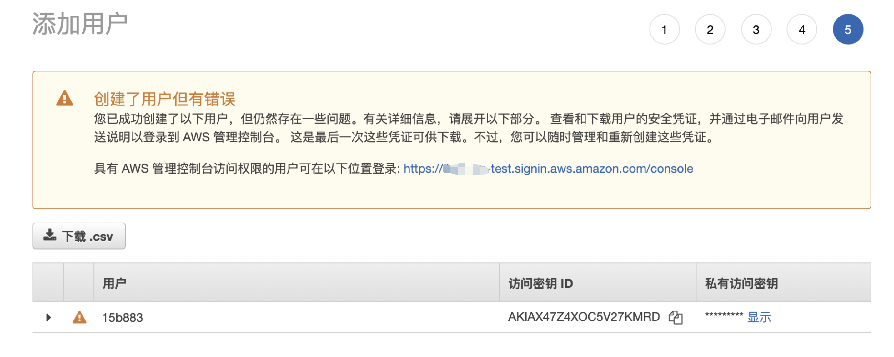
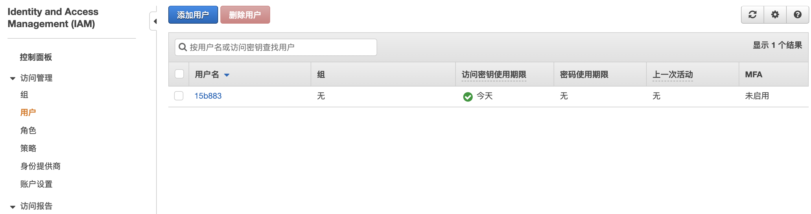

## 登录 AWS IAM 管理控制台 
通过以下网址打开 IAM 控制台 
https://console.aws.amazon.com/iam/
在导航窗格中，选择用户，然后选择添加用户

## 设置用户详情

* 用户可以选择创建一个或者创建多个

* 访问类型
编程访问：为 AWS API、CLI、SDK 和其他开发工具启用 访问密钥 ID 和 私有访问密钥 。
控制台访问:启用 密码 、使得用户可以登录到 AWS 管理控制台。

* 密码自需选择

## 权限选择

这里暂时直接选择附加现有的选择(也可以选择添加到用户组或者复制其他用户的权限)

> AdministratorAccess权限是除去根用户最大的权限

* 可以新创建组，也可以加入现有的组

将用户添加到组。如果您拥有具有已创建的适当的权限策略的组并想要向这些组分配用户，请选择此项。IAM 将显示所有当前已定义的组以及其附加的策略的列表。您可以选择一个或多个现有组，或者选择 Create group 来创建新组。

* 从现有用户复制权限

选择此选项可从现有用户将所有组成员资格、附加的托管策略和嵌入式内联策略复制到新用户。IAM 将显示当前定义的用户的列表。选择其权限与新用户的需求最为匹配的一个用户。每个新用户均可获得与所选用户相同的组成员资格和附加的策略。

* 直接附加现有策略

比如，此用户只访问使用S3服务。可在搜索里面搜索S3，选中显示的S3策略即可

直接将现有策略附加到用户 选择此选项可从现有托管策略中选择要附加到新用户的托管策略，或者创建新的要附加到新用户的托管策略。IAM 将显示当前定义的托管策略 (AWS 定义的和客户定义的) 的列表。选择您要附加到新用户的策略或选择 Create policy 以从头开始创建新策略。

## 创建用户
审核一下前面填写的信息没问题了就可以点击创建用户了

注意！！！

> 因为我们创建用户的时候选择了编程访问，所以这里的访问密钥(AKSK）会提示我们下载，只有这一次的下载机会，请务必保存好！！！
> 或者后期删除到这个AKSK再去创建新的，不过之前你配置文件里面的AKSK需要更换最新的
> 对于AKSK的最佳实践可以使用角色附加到资源实例上进行使用

