## 下载MFA软件

这里选择Google的Authenticator

## 进入IAM控制台

搜索IAM，点击进入

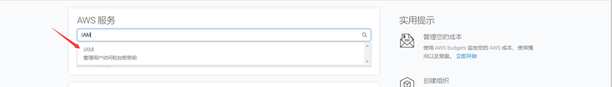

## 选择需要设置MFA的用户

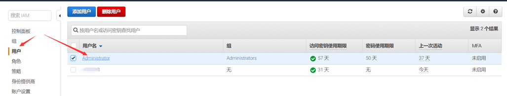

## 选择安全证书

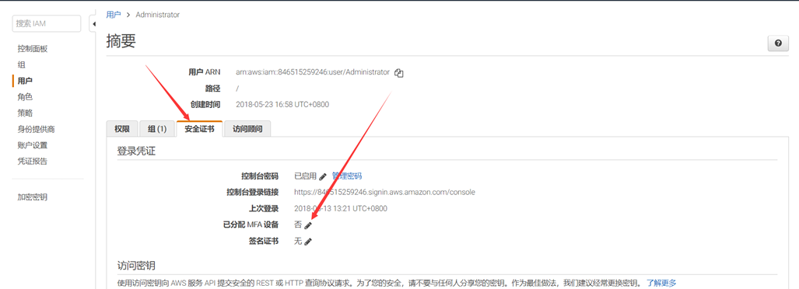

## 管理MFA设置

这里选择虚拟MFA

https://aws.amazon.com/cn/iam/details/mfa/

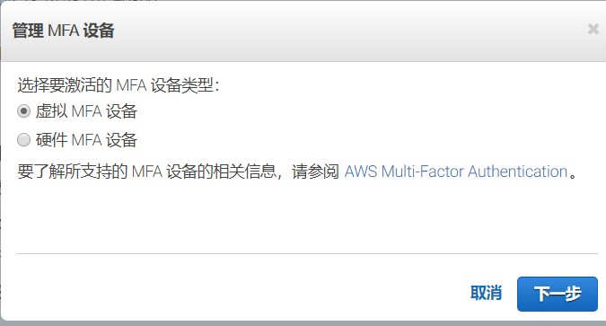

这里就是之前下载的Google的Authenticator

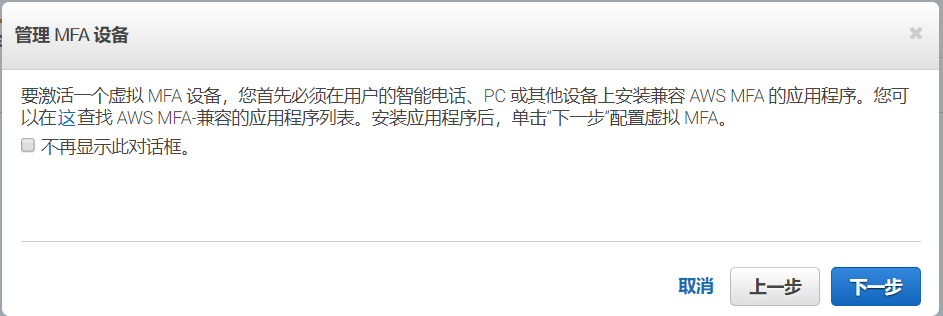

## 生成QR代码

IAM 将生成并显示虚拟 MFA 设备的配置信息，包括 QR 代码图形。

此图形是秘密配置密钥的表示形式，适用于不支持 QR 代码的设备上的手动输入。

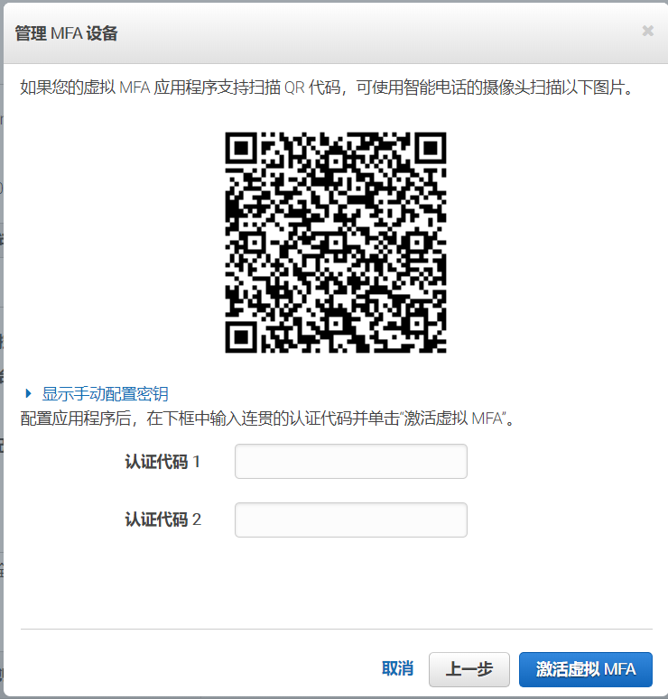

## Authenticator扫码验证

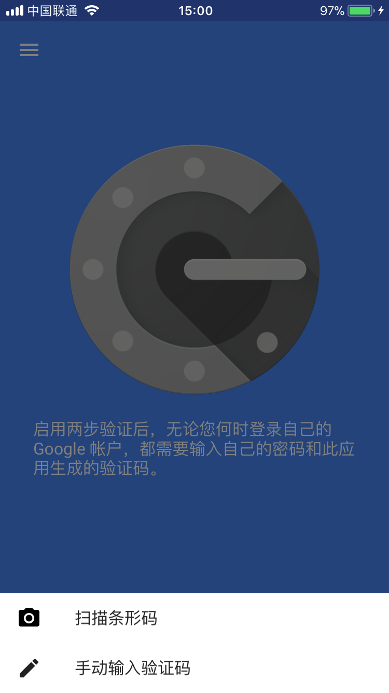

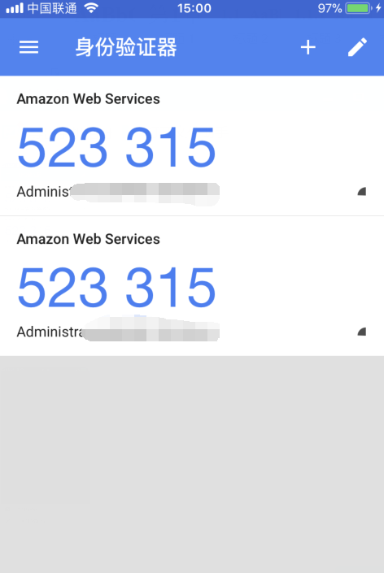

在扫码后，会生成一个6位数的一次性密码。

Authentication Code 1 输入验证码

等30秒后

Authentication Code 2 再次输入验证码

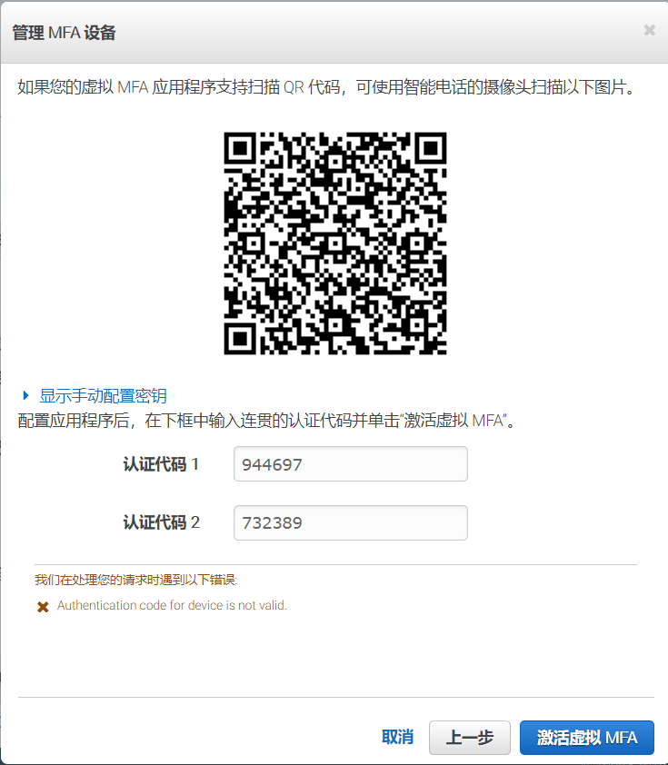

## 成功关联

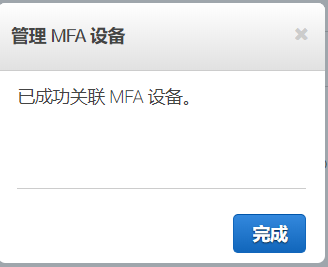

## 网页登陆验证

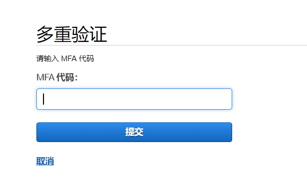

 