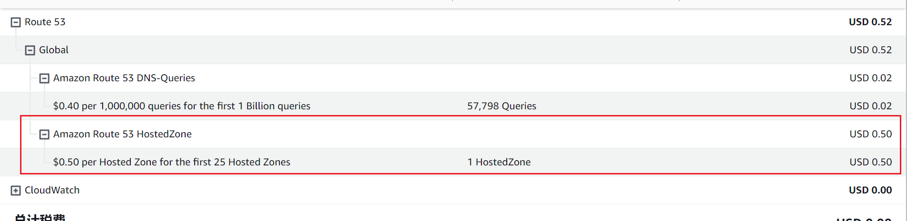

## Route53

我在aws 账号买了个io的域名，我也没做什么解析，发现每个月老扣我点钱。。

$0.50 per Hosted Zone for the first 25 Hosted Zones

对于您的AWS帐户中的前25个托管区域，每个托管区域每月收取$0.50的费用。如果您拥有超过25个托管区域，则超出的托管区域将按每个区域每月$0.10的费率收费。换句话说，这是每个托管区域的月度收费，用于托管DNS记录并提供DNS查询解析服务。

 $0.40 per 1,000,000 queries for the first 1 Billion queries

Route 53中的查询费用是每月前10亿次查询的每1,000,000次查询收费0.40美元。这意味着在一个月的前10亿次查询中，每1,000,000次查询的费用为0.40美元。如果一个月内的查询次数超过10亿，则每个查询的成本会降低。

（没懂为啥扣0.02）

收费标准：

https://aws.amazon.com/cn/route53/pricing/