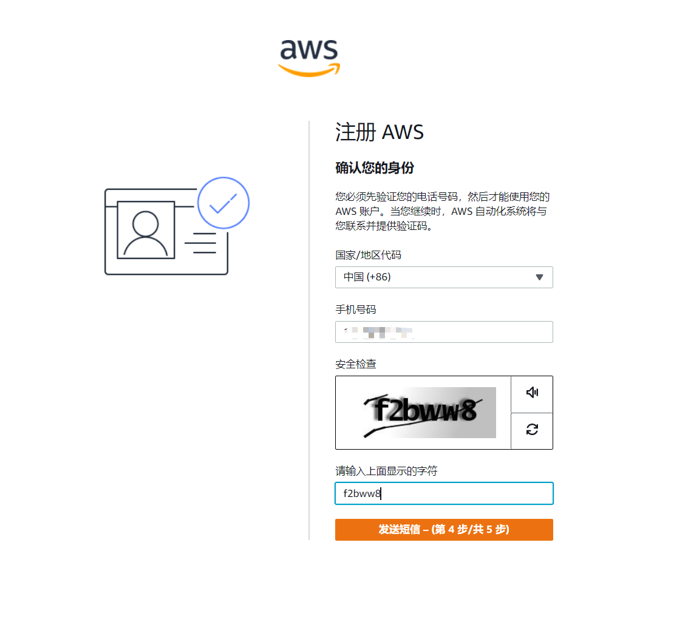

**准备事项**

可以上互联网的电脑（账号申请）
外币卡（1美金授权）
手机（接受短信验证码）

注册过程中需要绑定账单地址为中国国内的美金信用卡（Visa 或 Mastercard），绑定成功后会对您的信用卡进行1美金的预授权验证，检测信用卡的有效性，当月即会返还。

注册过程中AWS需要对您的手机进行验证，请您留意AWS的来电，号码以001开头。如果您没有收到电话，请检查是否有设置拒接海外来电，您可以通过刷新页面重新提交电话请求。 

**开始注册账号**

申请注册地址： https://portal.aws.amazon.com/billing/signup#/start

**注意！**

电子邮件地址：使用经常使用的Email或者是公司的Email

密码：建议使用21+以上位数的强密码

AWS账号名称：根据需求填写

**注意！**

联系人信息

选择此这账号是适用于工作还是个人测试使用

全名 随便写

**电话号码 这里需要填写你的手机号，因为一会需要你接收验证码使用**

地址、城市、地区、邮编、随便写

**注意**

账单信息

把刚才准备的外币信用卡信息输入上去。一会还要进行[1美元授权](https://www.cnblogs.com/syavingcs/p/14513137.html)使用

填写手机号

选择支持计划，这里选择免费的

注册成功后，你会在你的Email收到注册成功的邮件

